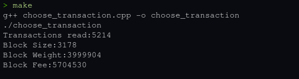

# My submission for Summer of Bitcoin Challenge

### Instructions
```shell
make          #To compile and run file for unix systems

make clean    #Clear build files for recompiling

make verify   # Verify the output from make
```
<br />

1. Runtime: 1:37 Minutes   (AMD Ryzen 7 4800H)

2. 

